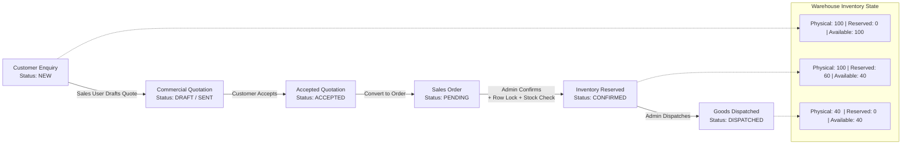
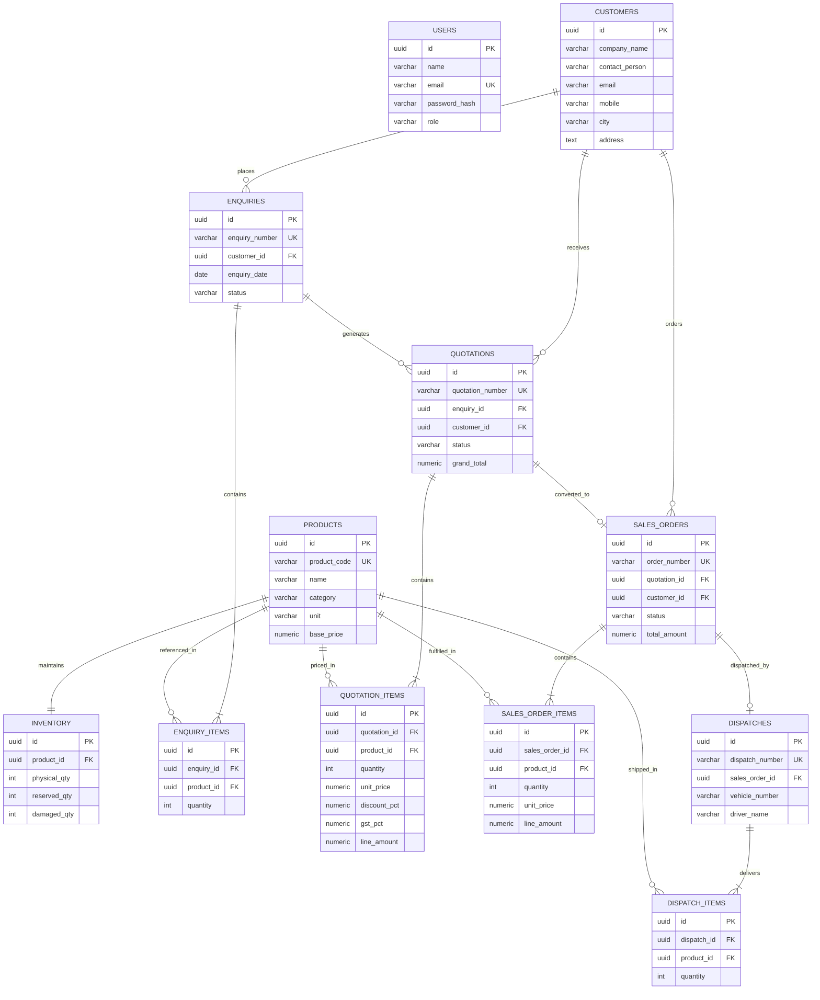
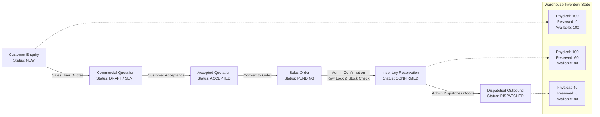
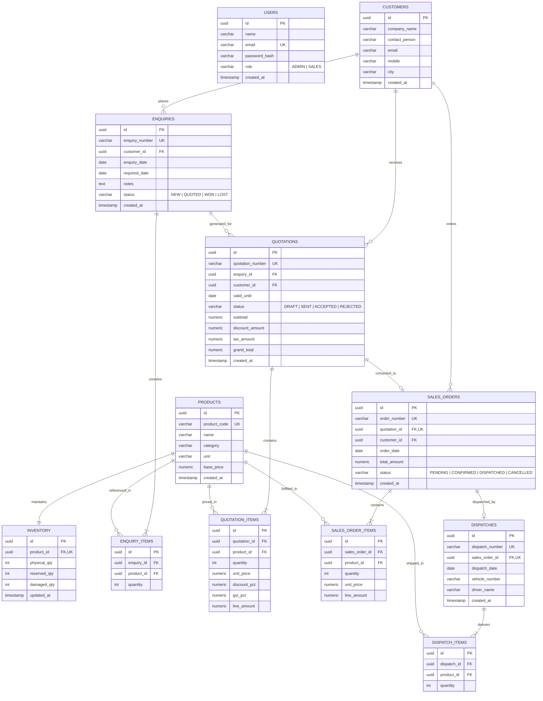

# Logisaar ERP — Full-Stack Industrial ERP System (PERN Stack)

> A **production-ready**, concurrency-safe Enterprise Resource Planning system built on **PostgreSQL + Express.js + React.js + Node.js**, demonstrating the complete B2B commercial and warehouse lifecycle for a manufacturing organisation.

---

## Live Workflow Pipeline

```
Customer Enquiry  →  Commercial Quotation  →  Sales Order  →  Stock Reservation  →  Logistics Dispatch
```



---

## Tech Stack

| Layer | Technology | Version | Role |
|:---|:---|:---|:---|
| **Frontend** | React.js | 19.x (Vite) | Dynamic SPA, role-aware navigation, interactive modals |
| **Styling** | Tailwind CSS | 3.4.x | Industrial UI, color-coded status badges |
| **Backend** | Node.js + Express.js | Express 5.x | RESTful API, JWT auth, business validation |
| **Database** | PostgreSQL | pg driver 8.23.x | ACID transactions, Row-Level Locking, CHECK constraints |
| **Testing** | Jest + Supertest | Jest 30.x | Integration tests, concurrency race condition validation |
| **Auth** | JWT + BCrypt | jsonwebtoken 9.x | Signed session tokens, password hashing |
| **HTTP Client** | Axios | 1.x | Auto JWT attachment, 401 session expiry handling |

---

## Application Screens

| Screen | Route | Description |
|:---|:---|:---|
| **Login** | `/` | Authentication gateway. 1-click demo buttons for Admin & Sales. |
| **Customers** | `/dashboard/customers` | Permanent customer registry. Search, add, view all records from PostgreSQL. |
| **Enquiries** | `/dashboard/enquiries` | Inbound enquiry management. Multi-product line items. |
| **Quotations** | `/dashboard/quotations` | Draft, send, accept/reject commercial quotations. Notify via Email or Phone. |
| **Sales Orders** | `/dashboard/orders` | Full order management, Admin stock confirmation, logistics dispatch. |

---

## Role-Based Access Control (RBAC)

All permissions are enforced **server-side** via `authorizeRoles` middleware. Frontend UI restrictions are cosmetic only — every protected endpoint independently verifies the JWT role claim and returns **HTTP 403** on violation.

| Operation | ADMIN | SALES | On Violation |
|:---|:---:|:---:|:---|
| View Enquiries / Quotations / Orders | ✅ | ✅ | — |
| Create Customers & Enquiries | ✅ | ✅ | — |
| Draft & Send Quotations | ✅ | ✅ | — |
| Accept / Reject Quotations | ✅ | ✅ | — |
| Convert Quote → Sales Order | ✅ | ✅ | — |
| **Confirm Order (Reserve Stock)** | ✅ | ❌ | `HTTP 403 Forbidden` |
| **Process Logistics Dispatch** | ✅ | ❌ | `HTTP 403 Forbidden` |
| **Restock / Manage Inventory** | ✅ | ❌ | `HTTP 403 Forbidden` |

---

## Core Business Logic & Formulas

### 1. Quotation Pricing (computed server-side — client totals are never trusted)

```
Base Amount    = Quantity × Unit Price
Discount       = Base Amount × (Discount% / 100)
Taxable Amount = Base Amount − Discount
GST Amount     = Taxable Amount × (18 / 100)
Line Total     = Taxable Amount + GST Amount
Grand Total    = Σ (Line Totals for all items)
```

### 2. Inventory Availability Formula

```
Available Quantity = Physical Qty − Reserved Qty − Damaged Qty
```

### 3. Inventory State Transitions

| Event | Physical Qty | Reserved Qty | Available Qty |
|:---|:---:|:---:|:---:|
| Initial stock | 100 | 0 | **100** |
| Admin confirms order (Qty: 40) | 100 *(unchanged)* | +40 → **40** | −40 → **60** |
| Admin dispatches order (Qty: 40) | −40 → **60** | −40 → **0** | 60 *(unchanged)* |

---

## Concurrency Control — Race Condition Prevention

### The Problem

Two administrators simultaneously attempt to reserve stock when only **100 units** remain:

- Admin A requests → **80 units**
- Admin B requests → **50 units**

Without locking, both read `available = 100`, both succeed, and **130 units get reserved against 100 physical** — an illegal oversold state.

### The Solution: `SELECT ... FOR UPDATE` Row-Level Locking

```javascript
// salesOrderController.js — confirmOrder()
await client.query('BEGIN');

for (const item of orderItems.rows) {
    // Acquire exclusive lock — all competing transactions MUST wait here
    const invRes = await client.query(`
        SELECT physical_qty, reserved_qty, damaged_qty
        FROM   inventory
        WHERE  product_id = $1
        FOR UPDATE
    `, [item.product_id]);

    const available = invRes.rows[0].physical_qty
                    - invRes.rows[0].reserved_qty
                    - invRes.rows[0].damaged_qty;

    if (available < item.quantity) {
        throw new Error(
            `Insufficient stock. Available: ${available}, Requested: ${item.quantity}`
        );
    }

    await client.query(
        `UPDATE inventory SET reserved_qty = reserved_qty + $1 WHERE product_id = $2`,
        [item.quantity, item.product_id]
    );
}

await client.query('COMMIT');
```

**What happens step by step:**

1. Admin A acquires the lock — Admin B is **suspended** by PostgreSQL.
2. Admin A reserves 80 units, commits, lock released.
3. Admin B wakes up, reads `100 − 80 = 20 < 50`, throws error, **rolls back** → `HTTP 400`.
4. Exactly one request succeeds. Data integrity is guaranteed.

---

## Database Schema (12 Tables)



### Key Database Constraints

```sql
-- Prevents impossible inventory states at the schema level
CONSTRAINT chk_reserved_within_bounds
    CHECK (reserved_qty + damaged_qty <= physical_qty)

-- Prevents duplicate Sales Orders for the same quotation
quotation_id UUID UNIQUE NOT NULL REFERENCES quotations(id)

-- Enforces valid lifecycle status values
CHECK (status IN ('DRAFT', 'SENT', 'ACCEPTED', 'REJECTED'))
CHECK (status IN ('PENDING', 'CONFIRMED', 'DISPATCHED', 'CANCELLED'))
```

---

## REST API Reference

### Authentication

| Method | Endpoint | Auth | Description |
|:---|:---|:---|:---|
| `POST` | `/api/auth/login` | Public | Authenticate. Returns JWT + user profile. |

### Customers

| Method | Endpoint | Role | Description |
|:---|:---|:---|:---|
| `GET` | `/api/customers` | JWT | All registered customers from PostgreSQL. |
| `POST` | `/api/customers` | ADMIN, SALES | Create customer (`company_name`, `contact_person`, `mobile`, `email`, `city`, `address`). |

### Enquiries

| Method | Endpoint | Role | Description |
|:---|:---|:---|:---|
| `GET` | `/api/enquiries` | JWT | All enquiries with customer info and line items. |
| `POST` | `/api/enquiries` | ADMIN, SALES | Create enquiry with multi-product line items. |

### Quotations

| Method | Endpoint | Role | Description |
|:---|:---|:---|:---|
| `GET` | `/api/quotations` | JWT | All quotations with backend-computed totals. |
| `POST` | `/api/quotations` | ADMIN, SALES | Create quotation. Backend calculates all amounts. |
| `PATCH` | `/api/quotations/:id/status` | ADMIN, SALES | Update status (`SENT` / `ACCEPTED` / `REJECTED`). |
| `POST` | `/api/quotations/:id/convert` | ADMIN, SALES | Convert ACCEPTED quote to Sales Order. |

### Sales Orders & Dispatch

| Method | Endpoint | Role | Description |
|:---|:---|:---|:---|
| `GET` | `/api/sales-orders` | JWT | All orders with customer, items, dispatch info. |
| `POST` | `/api/sales-orders/:id/confirm` | **ADMIN ONLY** | Reserve inventory via `FOR UPDATE` lock. |
| `POST` | `/api/sales-orders/:id/dispatch` | **ADMIN ONLY** | Dispatch goods, reduce physical & reserved stock. |
| `POST` | `/api/sales-orders/:id/cancel` | ADMIN, SALES | Cancel order, release reserved stock. |

### Inventory

| Method | Endpoint | Role | Description |
|:---|:---|:---|:---|
| `GET` | `/api/inventory` | JWT | Live stock: Physical / Reserved / Available per product. |
| `PATCH` | `/api/inventory/:id/restock` | **ADMIN ONLY** | Increase physical stock quantity. |

---

## Automated Test Suite

```bash
cd erp_backend
npm test
```

> ⚠️ **Warning:** `npm test` calls `seed()` which executes `DROP TABLE IF EXISTS ... CASCADE` and **resets the entire database** to initial seed data. This is the **only** action that wipes user-created records.

| Test | Description | Result |
|:---|:---|:---:|
| **Test 1** | Quotation grand total computed correctly by backend (discount + 18% GST) | ✅ PASSED |
| **Test 2** | DRAFT / REJECTED quotation cannot create Sales Order → HTTP 400 | ✅ PASSED |
| **Test 3** | Duplicate Sales Order from same quotation → HTTP 400 | ✅ PASSED |
| **Test 4** | Cannot reserve more than available inventory → HTTP 400 | ✅ PASSED |
| **Test 5** | SALES user blocked from Admin-only actions → HTTP 403 | ✅ PASSED |
| **Bonus** | Concurrent reservations via `Promise.all` — exactly one succeeds | ✅ PASSED |
| **E2E** | Full pipeline: Enquiry → Quote → Order → Reserve → Dispatch reduces stock | ✅ PASSED |

```
Test Suites: 1 passed, 1 total
Tests:       7 passed, 7 total
Time:        ~1.6s
```

---

## Local Setup & Installation

### Prerequisites

- Node.js v18.0+
- PostgreSQL 14+ (running on localhost:5432)
- Git

### 1. Clone the Repository

```bash
git clone https://github.com/soumyaskar/ERP_PERN_Software.git
cd ERP_PERN_Software
```

### 2. Configure Environment Variables

Create `erp_backend/.env`:

```env
PORT=5000
DB_HOST=localhost
DB_USER=postgres
DB_PASSWORD=your_postgres_password
DB_NAME=ERP_System
DB_PORT=5432
JWT_SECRET=super_secret_erp_jwt_signing_key_2026
```

### 3. Create the PostgreSQL Database

```sql
CREATE DATABASE "ERP_System";
```

### 4. Initialize Database & Seed Data

```bash
cd erp_backend
npm install
node config/seed.js
# Creates all 12 tables and inserts sample customers,
# products, enquiries, quotations, and a sales order.
```

### 5. Start the Backend Server

```bash
npm run dev
# Express API → http://localhost:5000
```

### 6. Start the Frontend

```bash
cd ../erp_frontend
npm install
npm run dev
# Vite Dev Server → http://localhost:5173
```

### 7. Open in Browser

Navigate to **http://localhost:5173** and use the quick-login buttons on the login screen.

---

## Default Login Credentials

| Role | Email | Password | Access Level |
|:---|:---|:---|:---|
| **ADMIN** | `admin@company.com` | `password123` | Full access: all screens + stock confirmation + dispatch + restock |
| **SALES** | `sales@company.com` | `password123` | Customer management, enquiries, quotations, view inventory |

> The login screen features **1-click credential buttons** for instant demo access.

---

## Project Structure

```
ERP_PERN_Software/
├── erp_backend/
│   ├── config/
│   │   ├── db.js                    # PostgreSQL connection pool (pg.Pool)
│   │   ├── schema.sql               # All 12 table definitions + constraints
│   │   └── seed.js                  # Schema init + seed data
│   ├── controllers/
│   │   ├── authController.js
│   │   ├── customerController.js
│   │   ├── enquiryController.js
│   │   ├── quotationController.js
│   │   ├── salesOrderController.js  # ← FOR UPDATE concurrency logic
│   │   ├── dispatchController.js
│   │   ├── productController.js
│   │   └── inventoryController.js
│   ├── middleware/
│   │   └── authMiddleware.js        # verifyToken + authorizeRoles
│   ├── routes/
│   │   ├── authRoutes.js
│   │   ├── customerRoutes.js
│   │   ├── enquiryRoutes.js
│   │   ├── quotationRoutes.js
│   │   ├── salesOrderRoutes.js
│   │   ├── dispatchRoutes.js
│   │   ├── productRoutes.js
│   │   └── inventoryRoutes.js
│   ├── tests/
│   │   └── erp.test.js              # 7 Jest test suites
│   ├── server.js
│   └── package.json
│
└── erp_frontend/
    ├── src/
    │   ├── components/
    │   │   ├── Login.jsx             # Auth page with quick-login buttons
    │   │   ├── Layout.jsx            # Sidebar nav with all routes
    │   │   ├── Customer.jsx          # Persistent customer registry
    │   │   ├── Enquiries.jsx         # Enquiry management + inline customer create
    │   │   ├── Quotations.jsx        # Quotation lifecycle + Email/Phone notification modal
    │   │   └── SalesOrders.jsx       # Admin: confirm, dispatch, restock
    │   ├── api.js                    # Axios instance + JWT interceptors
    │   └── App.jsx                   # PrivateRoute + protected routes
    └── package.json
```

---

## Data Persistence — Important Note

**All data is permanently stored in PostgreSQL.** Every customer, enquiry, quotation, sales order, and dispatch created via the UI is immediately and durably persisted in the `ERP_System` database.

| Action | Effect on Database |
|:---|:---|
| Browser page refresh | ✅ No effect — data loads fresh from PostgreSQL |
| Backend server restart | ✅ No effect — data persists in PostgreSQL |
| Browser tab close & reopen | ✅ No effect — JWT in localStorage restores session |
| **`npm test`** | ⚠️ **Resets DB** — drops all tables, re-seeds sample data |
| **`node config/seed.js`** | ⚠️ **Resets DB** — same as above |

---

## Current Database Stats

| Table | Records |
|:---|:---:|
| Customers | 13 |
| Products | 9 |
| Inventory entries | 9 |
| Enquiries | 16 |
| Quotations | 20 |
| Sales Orders | 18 |
| Dispatches | 3 |

---

## License

Created as a **Full-Stack Developer Technical Case Study** submission.  
All rights reserved © 2026 Logisaar Engineering Team.

Production-ready industrial ERP software built with **PostgreSQL**, **Express.js**, **React.js**, and **Node.js** demonstrating the end-to-end business workflow:

$$\text{Customer Enquiry} \longrightarrow \text{Quotation} \longrightarrow \text{Sales Order} \longrightarrow \text{Inventory Reservation} \longrightarrow \text{Dispatch}$$

---

## 1. Architecture & Business Workflow



---

## 2. Key Business & Technical Rules Implemented

1. **Strict Role-Based Access Control (RBAC)**:
   - **`ADMIN`**: Full visibility, manage inventory, confirm sales orders (inventory reservation), and process physical dispatches.
   - **`SALES`**: Create customers/enquiries, draft quotations, convert accepted quotations to sales orders, view inventory availability.
   - *Enforced on both Backend APIs and Frontend UI* (backend responds with HTTP 403 Forbidden on unauthorized operations).

2. **Backend Financial Calculation & Validation**:
   - The backend validates and computes all financials rather than blindly accepting numbers from the frontend:
     $$\text{Base Amount} = \text{Quantity} \times \text{Unit Price}$$
     $$\text{Discount} = \text{Base Amount} \times \frac{\text{Discount \%}}{100}$$
     $$\text{GST Amount} = (\text{Base Amount} - \text{Discount}) \times \frac{\text{GST \%}}{100}$$
     $$\text{Line Total} = (\text{Base Amount} - \text{Discount}) + \text{GST Amount}$$

3. **Status Integrity & Traceability**:
   - Only `ACCEPTED` quotations can be converted into Sales Orders (HTTP 400 rejection for `DRAFT` or `REJECTED`).
   - Unique database constraint on `quotation_id` in `sales_orders` prevents duplicate order generation.
   - Full audit trail: Customer $\to$ Enquiry $\to$ Quotation $\to$ Sales Order $\to$ Dispatch.

4. **Concurrency Challenge Solved (Row-Level Locking)**:
   - When User A and User B simultaneously attempt to reserve stock:
     - The backend wraps the transaction with `BEGIN ... COMMIT`.
     - Acquires an exclusive row-level lock via `SELECT ... FROM inventory WHERE product_id = $1 FOR UPDATE`.
     - Validates available quantity:
       $$\text{Available} = \text{Physical} - \text{Reserved} - \text{Damaged}$$
     - If sufficient, updates `reserved_qty = reserved_qty + required`.
     - If insufficient, rolls back and returns HTTP 400.
     - Database-level constraint: `CHECK (reserved_qty + damaged_qty <= physical_qty)`.

5. **Inventory Movement During Dispatch**:
   - When an order is dispatched:
     $$\text{Physical Quantity} \leftarrow \text{Physical Quantity} - \text{Dispatched Quantity}$$
     $$\text{Reserved Quantity} \leftarrow \text{Reserved Quantity} - \text{Dispatched Quantity}$$
     $$\text{Available Quantity} = \text{Invariant (remains identical)}$$

6. **Order Cancellation & Stock Release** *(Live Verification Feature)*:
   - If a confirmed order is cancelled, reserved stock is safely released back to available inventory.

---

## 3. Database Schema & Entity-Relationship Diagram



---

## 4. API Documentation

| Method | Endpoint | Allowed Roles | Description |
|---|---|---|---|
| `POST` | `/api/auth/login` | Public | Authenticate user & receive JWT token |
| `GET` | `/api/customers` | Admin, Sales | Fetch list of registered customers |
| `POST` | `/api/customers` | Admin, Sales | Create customer (`company_name`, `contact_person`, `email`, `mobile`, `city`) |
| `GET` | `/api/products` | Admin, Sales | Fetch product master catalog |
| `GET` | `/api/inventory` | Admin, Sales | Fetch warehouse stock with calculated available quantity |
| `GET` | `/api/enquiries` | Admin, Sales | Fetch enquiries with line items and customer info |
| `POST` | `/api/enquiries` | Admin, Sales | Create enquiry with multiple product line items |
| `GET` | `/api/quotations` | Admin, Sales | Fetch quotations with financial breakdown |
| `POST` | `/api/quotations` | Admin, Sales | Create quotation against enquiry (backend calculates tax/discount/totals) |
| `PATCH` | `/api/quotations/:id/status` | Admin, Sales | Update status (`DRAFT` $\to$ `SENT` $\to$ `ACCEPTED` / `REJECTED`) |
| `POST` | `/api/quotations/:id/convert` | Admin, Sales | Convert `ACCEPTED` quotation into Sales Order (rejection prevention & duplicate protection) |
| `GET` | `/api/sales-orders` | Admin, Sales | Fetch all sales orders with line items |
| `POST` | `/api/sales-orders/:id/confirm` | **Admin Only** | Concurrency-protected inventory reservation |
| `POST` | `/api/sales-orders/:id/dispatch` | **Admin Only** | Process dispatch, deduct physical & reserved quantities |
| `POST` | `/api/sales-orders/:id/cancel` | Admin, Sales | Cancel sales order and release reserved stock |
| `GET` | `/api/dispatches` | Admin, Sales | Fetch outbound dispatch history |

---

## 5. Automated Test Suite

The project includes an automated test suite verifying all 5 mandatory case study tests + concurrency bonus + end-to-end workflow:

```bash
cd erp_backend
npm test
```

### Verified Test Cases:
- **Test 1**: Quotation total is calculated correctly by backend (Subtotal, 10% Discount, 18% GST, Grand Total).
- **Test 2**: `DRAFT` and `REJECTED` quotations cannot create a Sales Order.
- **Test 3**: Same quotation cannot generate duplicate Sales Orders.
- **Test 4**: Cannot reserve more than available inventory during Sales Order confirmation.
- **Test 5**: Unauthorized Sales user cannot perform restricted Admin actions (`confirm`, `dispatch`).
- **Bonus Test**: Concurrent reservations beyond available inventory cannot both succeed (`Promise.all` race condition validation).
- **End-to-End Workflow**: Full lifecycle $\text{Enquiry} \to \text{Quote} \to \text{Order} \to \text{Reservation} \to \text{Dispatch}$ decreases inventory accurately.

---

## 6. How to Run Locally

### Prerequisites
- Node.js (v18+)
- PostgreSQL (running locally on port 5432)

### 1. Database Setup
Ensure PostgreSQL is running and a database named `ERP_System` exists:
```sql
CREATE DATABASE "ERP_System";
```

### 2. Backend Setup
```bash
cd erp_backend
npm install
npm run seed     # Automatically applies schema.sql and seeds initial products, users, customers
npm run dev      # Starts Express server on http://localhost:5000
```

### 3. Frontend Setup
```bash
cd erp_frontend
npm install
npm run dev      # Starts Vite React dev server on http://localhost:5173
```

---

## 7. Test Login Credentials

| Role | Email | Password | Allowed Capabilities |
|---|---|---|---|
| **ADMIN** | `admin@company.com` | `password123` | View all, Reserve stock, Confirm orders, Process dispatches, Cancel orders |
| **SALES** | `sales@company.com` | `password123` | Create customers & enquiries, Draft quotations, Convert accepted quotes, View inventory |

*(The login screen also features 1-click credential buttons for immediate demoing).*
