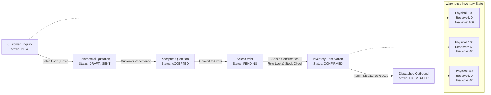

# Logisaar ERP — Full-Stack Technical Case Study (PERN Stack)

Production-ready industrial ERP software built with **PostgreSQL**, **Express.js**, **React.js**, and **Node.js** demonstrating the end-to-end business workflow:

$$\text{Customer Enquiry} \longrightarrow \text{Quotation} \longrightarrow \text{Sales Order} \longrightarrow \text{Inventory Reservation} \longrightarrow \text{Dispatch}$$

---

## 1. Architecture & Business Workflow



---

## 2. Key Business & Technical Rules Implemented

1. **Strict Role-Based Access Control (RBAC)**:
   - **`ADMIN`**: Full visibility, manage inventory, confirm sales orders (inventory reservation), and process physical dispatches.
   - **`SALES`**: Create customers/enquiries, draft quotations, convert accepted quotations to sales orders, view inventory availability.
   - *Enforced on both Backend APIs and Frontend UI* (backend responds with HTTP 403 Forbidden on unauthorized operations).

2. **Backend Financial Calculation & Validation**:
   - The backend validates and computes all financials rather than blindly accepting numbers from the frontend:
     $$\text{Base Amount} = \text{Quantity} \times \text{Unit Price}$$
     $$\text{Discount} = \text{Base Amount} \times \frac{\text{Discount \%}}{100}$$
     $$\text{GST Amount} = (\text{Base Amount} - \text{Discount}) \times \frac{\text{GST \%}}{100}$$
     $$\text{Line Total} = (\text{Base Amount} - \text{Discount}) + \text{GST Amount}$$

3. **Status Integrity & Traceability**:
   - Only `ACCEPTED` quotations can be converted into Sales Orders (HTTP 400 rejection for `DRAFT` or `REJECTED`).
   - Unique database constraint on `quotation_id` in `sales_orders` prevents duplicate order generation.
   - Full audit trail: Customer $\to$ Enquiry $\to$ Quotation $\to$ Sales Order $\to$ Dispatch.

4. **Concurrency Challenge Solved (Row-Level Locking)**:
   - When User A and User B simultaneously attempt to reserve stock:
     - The backend wraps the transaction with `BEGIN ... COMMIT`.
     - Acquires an exclusive row-level lock via `SELECT ... FROM inventory WHERE product_id = $1 FOR UPDATE`.
     - Validates available quantity:
       $$\text{Available} = \text{Physical} - \text{Reserved} - \text{Damaged}$$
     - If sufficient, updates `reserved_qty = reserved_qty + required`.
     - If insufficient, rolls back and returns HTTP 400.
     - Database-level constraint: `CHECK (reserved_qty + damaged_qty <= physical_qty)`.

5. **Inventory Movement During Dispatch**:
   - When an order is dispatched:
     $$\text{Physical Quantity} \leftarrow \text{Physical Quantity} - \text{Dispatched Quantity}$$
     $$\text{Reserved Quantity} \leftarrow \text{Reserved Quantity} - \text{Dispatched Quantity}$$
     $$\text{Available Quantity} = \text{Invariant (remains identical)}$$

6. **Order Cancellation & Stock Release** *(Live Verification Feature)*:
   - If a confirmed order is cancelled, reserved stock is safely released back to available inventory.

---

## 3. Database Schema & Entity-Relationship Diagram


---

## 4. API Documentation

| Method | Endpoint | Allowed Roles | Description |
|---|---|---|---|
| `POST` | `/api/auth/login` | Public | Authenticate user & receive JWT token |
| `GET` | `/api/customers` | Admin, Sales | Fetch list of registered customers |
| `POST` | `/api/customers` | Admin, Sales | Create customer (`company_name`, `contact_person`, `email`, `mobile`, `city`) |
| `GET` | `/api/products` | Admin, Sales | Fetch product master catalog |
| `GET` | `/api/inventory` | Admin, Sales | Fetch warehouse stock with calculated available quantity |
| `GET` | `/api/enquiries` | Admin, Sales | Fetch enquiries with line items and customer info |
| `POST` | `/api/enquiries` | Admin, Sales | Create enquiry with multiple product line items |
| `GET` | `/api/quotations` | Admin, Sales | Fetch quotations with financial breakdown |
| `POST` | `/api/quotations` | Admin, Sales | Create quotation against enquiry (backend calculates tax/discount/totals) |
| `PATCH` | `/api/quotations/:id/status` | Admin, Sales | Update status (`DRAFT` $\to$ `SENT` $\to$ `ACCEPTED` / `REJECTED`) |
| `POST` | `/api/quotations/:id/convert` | Admin, Sales | Convert `ACCEPTED` quotation into Sales Order (rejection prevention & duplicate protection) |
| `GET` | `/api/sales-orders` | Admin, Sales | Fetch all sales orders with line items |
| `POST` | `/api/sales-orders/:id/confirm` | **Admin Only** | Concurrency-protected inventory reservation |
| `POST` | `/api/sales-orders/:id/dispatch` | **Admin Only** | Process dispatch, deduct physical & reserved quantities |
| `POST` | `/api/sales-orders/:id/cancel` | Admin, Sales | Cancel sales order and release reserved stock |
| `GET` | `/api/dispatches` | Admin, Sales | Fetch outbound dispatch history |

---

## 5. Automated Test Suite

The project includes an automated test suite verifying all 5 mandatory case study tests + concurrency bonus + end-to-end workflow:

```bash
cd erp_backend
npm test
```

### Verified Test Cases:
- **Test 1**: Quotation total is calculated correctly by backend (Subtotal, 10% Discount, 18% GST, Grand Total).
- **Test 2**: `DRAFT` and `REJECTED` quotations cannot create a Sales Order.
- **Test 3**: Same quotation cannot generate duplicate Sales Orders.
- **Test 4**: Cannot reserve more than available inventory during Sales Order confirmation.
- **Test 5**: Unauthorized Sales user cannot perform restricted Admin actions (`confirm`, `dispatch`).
- **Bonus Test**: Concurrent reservations beyond available inventory cannot both succeed (`Promise.all` race condition validation).
- **End-to-End Workflow**: Full lifecycle $\text{Enquiry} \to \text{Quote} \to \text{Order} \to \text{Reservation} \to \text{Dispatch}$ decreases inventory accurately.

---

## 6. How to Run Locally

### Prerequisites
- Node.js (v18+)
- PostgreSQL (running locally on port 5432)

### 1. Database Setup
Ensure PostgreSQL is running and a database named `ERP_System` exists:
```sql
CREATE DATABASE "ERP_System";
```

### 2. Backend Setup
```bash
cd erp_backend
npm install
npm run seed     # Automatically applies schema.sql and seeds initial products, users, customers
npm run dev      # Starts Express server on http://localhost:5000
```

### 3. Frontend Setup
```bash
cd erp_frontend
npm install
npm run dev      # Starts Vite React dev server on http://localhost:5173
```

---

## 7. Test Login Credentials

| Role | Email | Password | Allowed Capabilities |
|---|---|---|---|
| **ADMIN** | `admin@company.com` | `password123` | View all, Reserve stock, Confirm orders, Process dispatches, Cancel orders |
| **SALES** | `sales@company.com` | `password123` | Create customers & enquiries, Draft quotations, Convert accepted quotes, View inventory |

*(The login screen also features 1-click credential buttons for immediate demoing).*
